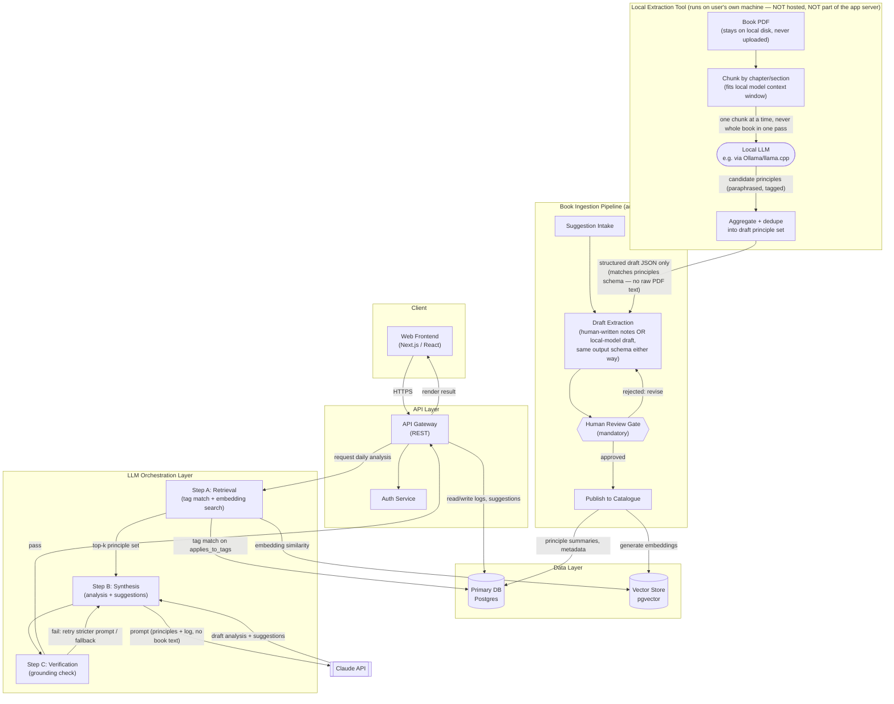

# Lens — Book-Grounded Life Analysis App: Architecture

## 1. System Architecture Diagram



**Walkthrough**

- The **frontend** never talks to the LLM directly — everything routes through the **API gateway**, which is the single point where auth, rate limiting, and logging happen.
- The **primary DB (Postgres)** is the source of truth for users, daily logs, book/principle metadata, suggestions, and streak data. It never holds book text — only human-written principle summaries capped in length (enforced server-side).
- The **vector store** holds embeddings of principle *summaries* and tags only — not book content. Starting as a `pgvector` extension on the same Postgres instance keeps the system to one database until the corpus size justifies a dedicated store (see Tech Stack).
- The **orchestration layer** is split into three testable steps — retrieval, synthesis, verification — each independently callable and independently mockable in tests. This satisfies the guideline that retrieval and synthesis must not be one opaque prompt.
- The **ingestion pipeline** is a separate, offline/admin-only flow. It is intentionally disconnected from the runtime request path: nothing a live user does can trigger new "book knowledge" to enter the system. This is a hard boundary against runtime injection of unreviewed or verbatim content.
- The **local extraction tool** is a separate, optional front-end to ingestion — it runs entirely on the person's own machine against their own local model, and its *only* connection to the rest of the system is handing a structured draft (the same shape a human editor would produce) into the existing Draft Extraction step. The book PDF and all raw chunk-level model output stay local and are never transmitted to the app server, the database, or any hosted LLM API.

---

## 2. Book Ingestion Pipeline

**Flow: suggestion → draft (human notes OR local-model extraction) → mandatory human review → publish.**

There are now two ways to reach "draft," converging on the same schema and the same review gate. Nothing downstream of Draft Extraction changes — this is intentional, so retrieval, synthesis, and the data model don't need to know or care which path produced a principle.

- **Suggestion intake**
  - Anyone (admin or user, if user-suggestion is enabled) submits only `title` + `author`. There is no file-upload or "paste chapter" affordance anywhere in the *hosted app's* ingestion UI — this stays enforced structurally, not just by policy. (The local extraction tool below is a separate, local-only piece of software — the hosted app itself still never accepts a PDF upload.)
  - System does a metadata lookup (title, author, publication year) via a public book-metadata API. No book text is fetched.

- **Draft extraction — Path A: human-written (unchanged)**
  - A human editor who has independently read/owns a licensed copy of the book writes principle drafts from their own notes.
  - An LLM may assist only as a *rewording/structuring* aid on the editor's own paraphrased notes — never given the book text, never asked to "summarize the book" from scratch.

- **Draft extraction — Path B: local-model extraction (new)**
  - Runs entirely on the user's own machine, against a local model (e.g. via Ollama/llama.cpp) — the PDF is parsed locally (e.g. PyMuPDF), never uploaded anywhere.
  - **Chunking is required, not optional:** most local models' context windows can't hold a full book, and even for ones that can, chunking keeps each individual model call scoped to a small span of source text rather than the whole work — chapter-by-chapter or section-by-section, with the `source_chapter` reference carried through.
  - **Per-chunk pass:** the local model drafts candidate principles from that chunk only, under the same rules as a human editor would follow — paraphrase, no verbatim reproduction, quotes ≤15 words, one quote max per candidate principle. These constraints are stated in the local extraction tool's own prompt, same as the runtime synthesis prompt in §3.
  - **Aggregation pass:** a second local-model pass merges and dedupes candidate principles across chunks into one draft `core_thesis` and a consolidated `principles` list with `applies_to_tags`.
  - **Output boundary:** only the structured draft JSON (matching the `books`/`principles` shape) crosses out of this tool. The PDF, the raw per-chunk model output, and any intermediate text never leave the local machine or enter the app's database, vector store, or logs.
  - This draft is submitted into the *same* Draft Extraction queue as Path A, tagged `extraction_method: local_model` (see §4) so reviewers know a human hasn't yet read the source material behind this specific draft.

- **Human Review Gate — mandatory, cannot be skipped, for both paths**
  - A reviewer checks:
    - No sentence exceeds the quote threshold (≤15 words, ≤1 quote per principle).
    - The summary reflects the book's actual argument (fidelity check).
    - `applies_to_tags` are sane and support retrieval.
  - **For `extraction_method: local_model` drafts specifically:** the reviewer's job is heavier than a spot-check on human-drafted notes — they're the *first* human to compare the draft against the actual book at all, since no one else read it in this path. For personal/single-user use this reviewer is just you; for anything beyond that, treat this as a full read-through, not a skim.
  - **Why this step can't be skipped (more true than ever for Path B):** with a human author of the notes, one layer of "does this represent the book" judgment already happened before review. With local-model extraction, review is the *only* point where anyone checks the model didn't misstate, invert, or hallucinate the author's actual argument — a failure mode this pipeline has no other defense against.

- **Publish**
  - On approval: `review_status` flips to `human_reviewed`, a `version` increments, embeddings are (re)generated for the summary + tags, and the entry becomes retrievable.
  - Rejected drafts route back to drafting with reviewer comments attached.
  - Published principles remain user-flaggable ("this doesn't match the book") which reopens the review queue.

---

## 3. Retrieval + Analysis Engine

### Step A — Retrieval (deterministic, testable independently of the LLM)

Hybrid, two-signal retrieval — no LLM call in this step:

1. **Tag matching (fast path):** each log entry's `category` (and any inferred tags from free-text `action`, done via a small local classifier or simple keyword map — not the main LLM) is matched against `principles.applies_to_tags` for the chosen book. Deterministic, cheap, explainable.
2. **Embedding similarity (recall path):** the concatenated day's log text is embedded and compared via cosine similarity against principle `summary` embeddings for that book only (scoped query, not cross-book).
3. **Rank fusion:** combine tag-match hits (weighted higher, since they're precise) with top embedding matches; return top 3–5 `principle_id`s. This ranked list is a plain data structure — testable with fixed inputs and expected outputs, independent of any LLM behavior.

### Step B — Synthesis (LLM call)

Prompt template skeleton:

```
SYSTEM:
You are writing a personal daily reflection for a user, grounded strictly
in the following book's ideas. Tone: {book_tone}.
You must only use the principles provided below. Do not use any other
knowledge of this book. Do not quote more than 15 words verbatim from
any single principle summary, and do not quote more than once per
principle. If a quote isn't necessary, paraphrase instead.

BOOK: {book_title} by {book_author}
CORE THESIS: {core_thesis}

RETRIEVED PRINCIPLES (use only these, cite by name and principle_id):
{for each retrieved principle:
  - id: {principle_id}
    name: {principle_name}
    summary: {principle_summary}
}

USER'S DAY:
Date: {date}
Mood (1-5, optional): {mood}
Logged entries:
{for each entry: "- {time}: {action} [{category}]"}

PRIOR SUGGESTIONS STATUS (yesterday, if any):
{for each prior suggestion: "- {text} -> {status: done|skipped}"}

TASK:
Return valid JSON only, matching this shape:
{
  "analysis": "2-4 sentences, written through the lens of the principles above,
               referencing the user's actual logged entries",
  "suggestions": [
    {
      "text": "one concrete, doable action for tomorrow",
      "principle_id": "must be one of the retrieved principle_ids above"
    }
    // 1-3 items
  ]
}
No prose outside the JSON. No new principle names not listed above.
```

### Step C — Verification (self-check before showing the user)

A **grounding check**, run automatically after synthesis and before any result reaches the frontend:

- Rule-based pass (cheap, no LLM): parse the JSON; reject if any `suggestion.principle_id` is not in the retrieved set passed to the prompt; reject if any quoted span (text in quotation marks) exceeds 15 words or a principle is quoted more than once.
- LLM entailment pass (one small, cheap call): given *only* the retrieved principle summaries (not the book, not prior chat) and the generated `analysis` text, ask a separate classifier prompt: "Does this analysis make any claim that is NOT supported by the principle summaries provided? Answer PASS or FAIL with a one-line reason." This catches semantic hallucination that regex can't (e.g., analysis attributing an idea to the book that isn't in the retrieved summaries).
- On FAIL from either pass: retry synthesis once with a stricter prompt reminder; if it fails twice, fall back to a template response ("Today's entries connect to **{principle_name}** — here's what that principle says: {summary}") that is provably grounded because it's just displaying the reviewed principle text directly, with no free-form generation.

This makes retrieval and synthesis independently testable (§6) and gives verification a concrete, automatable check rather than "trust the model."

---

## 4. Data Model

Note: the draft `book` schema is extended with a `tracked_metrics` field, since §4 streak tracking needs a book-defined dimension (e.g., "consistency," "control vs. non-control") to track against — this keeps the catalogue-as-data-not-code guideline intact (no per-book code for what gets tracked).

```json
// books
{
  "book_id": "atomic-habits",
  "title": "Atomic Habits",
  "author": "James Clear",
  "core_thesis": "string, human-written, <=150 words",
  "tone": "pragmatic | philosophical | spiritual | scientific | narrative",
  "tracked_metrics": [
    {"id": "consistency", "label": "Consistency", "description": "string"}
  ],
  "review_status": "human_reviewed | pending_review",
  "extraction_method": "human_written | local_model",
  "version": 3,
  "created_at": "timestamp",
  "updated_at": "timestamp"
}
```

```json
// principles
{
  "principle_id": "identity-based-habits",
  "book_id": "atomic-habits",
  "name": "Identity-based habits",
  "summary": "string, human-written, <=200 words, no verbatim text",
  "source_chapter": "ch. 2",
  "applies_to_tags": ["habit-formation", "self-image"],
  "embedding_id": "vec_9f21...",
  "review_status": "human_reviewed | pending_review",
  "created_at": "timestamp",
  "updated_at": "timestamp"
}
```

```json
// users
{
  "user_id": "uuid",
  "email_encrypted": "bytes",
  "auth_provider_id": "string",
  "active_book_id": "atomic-habits",
  "timezone": "America/Chicago",
  "created_at": "timestamp"
}
```

```json
// daily_logs   (unique on user_id + date)
{
  "log_id": "uuid",
  "user_id": "uuid",
  "date": "2026-07-01",
  "chosen_book_id": "atomic-habits",
  "entries": [
    {"time": "07:30", "action": "went for a run", "category": "health"}
  ],
  "mood": 4,
  "created_at": "timestamp",
  "updated_at": "timestamp"
}
```

```json
// analyses   (1:1 with a daily_log, output of Step B/C)
{
  "analysis_id": "uuid",
  "log_id": "uuid",
  "retrieved_principle_ids": ["identity-based-habits", "habit-stacking"],
  "analysis_text": "string",
  "verification_status": "passed | fallback_used",
  "created_at": "timestamp"
}
```

```json
// suggestions
{
  "suggestion_id": "uuid",
  "analysis_id": "uuid",
  "principle_id": "identity-based-habits",
  "text": "string",
  "status": "pending | done | skipped",
  "created_at": "timestamp",
  "resolved_at": "timestamp | null"
}
```

```json
// streaks_progress
{
  "streak_id": "uuid",
  "user_id": "uuid",
  "book_id": "atomic-habits",
  "metric_id": "consistency",
  "current_streak_days": 12,
  "longest_streak_days": 21,
  "trend_series": [
    {"date": "2026-06-30", "score": 78}
  ],
  "updated_at": "timestamp"
}
```

---

## 5. Tech Stack

| Component | Choice | Why | Rejected alternative |
|---|---|---|---|
| Frontend | Next.js (React) | SSR for fast first paint + easy static marketing pages alongside the app | Plain Vite SPA — simpler, but loses SSR benefits for no real gain here |
| API layer | FastAPI (Python) | First-class async support, strong typing via Pydantic doubles as request/response schema validation for the JSON contracts in §3–4 | Node.js/NestJS — equally viable, rejected only to keep one language across API + any ML-adjacent retrieval code |
| Primary DB | Postgres | Relational integrity for the user→log→suggestion→streak chain; mature, boring, well-understood ops story | MongoDB — schema flexibility not needed here since the data model is well-defined; relational joins are the common access pattern |
| Vector store | Postgres + `pgvector` | Keeps infra to one database at this scale (principle corpus is small — hundreds to low thousands of rows, not millions) | Dedicated vector DB (Pinecone/Weaviate) — premature; revisit if catalogue exceeds ~10k principles or query latency becomes a problem |
| Embeddings | Voyage AI text embeddings | Purpose-built for retrieval, integrates cleanly with an Anthropic-based stack | Open-source (e.g., BGE) self-hosted — avoids a vendor dependency but adds hosting/ops burden not justified at current scale |
| LLM | Claude API | Strong instruction-following for structured-JSON output and for staying inside the "use only these principles" constraint | Self-hosted open-weight model — more control, but weaker reliability on strict grounding instructions without heavy fine-tuning |
| Auth | Managed auth provider (e.g., Auth0/Clerk) | Offloads credential security, session handling, and compliance surface | Rolled-in-house auth — more control, materially higher security risk and build time for no product differentiation |
| Background jobs | Redis + a queue library (e.g., BullMQ or Python RQ) | Ingestion (embedding generation) and nightly streak recomputation are async, retry-friendly workloads | Fully serverless cron functions only — workable, rejected because retry/backoff semantics are easier to reason about with an explicit queue |
| Hosting | Managed platform (e.g., Fly.io or a single cloud provider's App Runner/ECS) | Boring, proven, avoids building deployment infra from scratch | Self-managed Kubernetes — more flexibility, unjustified operational overhead at this stage |
| Encryption | TLS in transit; provider-managed encryption at rest (e.g., RDS/Cloud SQL encryption) + column-level encryption for `email` | Meets §3's data-protection requirement without inventing custom crypto | Custom application-layer encryption for all fields — higher engineering cost, marginal benefit over managed at-rest encryption for this data sensitivity level |
| Local extraction runtime | Ollama (or llama.cpp directly) + a local model, run as a standalone CLI/script outside the app repo, **default** | Keeps the PDF and all raw model output off any network the app server touches; the tool's only output is the draft JSON handed to Draft Extraction | A hosted LLM API for extraction — rejected as the *default* specifically because it would mean uploading full book text to a third party, which is what running this locally is meant to avoid. **Update:** the tool now also supports an explicit, opt-in `--provider groq` backend (Groq's free-tier hosted API) for personal use where a local model's quality is the bottleneck — never the default, and it reverses this row's guarantee whenever chosen. See §8. |

---

## 6. Evaluation Plan

**Goal:** before shipping, confirm the analysis engine is faithful to the book's actual principles — not fluent-sounding but ungrounded text.

- **Build a golden set of 8 cases** spanning at least 3 books with different tones (e.g., pragmatic/Atomic Habits, philosophical/a Stoic text, narrative-style book):
  - For each case: a synthetic daily log (realistic mixed entries), the book, and a **human-determined expected principle set** (which principle_ids a domain-knowledgeable reviewer says should surface).
- **Retrieval evaluation (Step A, no LLM involved):**
  - Run retrieval only; compute precision/recall of returned `principle_id`s against the expected set for each case.
  - Threshold: recall ≥ 0.8 (missing an obviously relevant principle is worse than an extra one) before Step A is considered ready.
- **Synthesis + verification evaluation (Steps B/C):**
  - Run full pipeline on all 8 cases, capture `analysis_text` and `suggestions`.
  - Two human reviewers, each shown *only* the retrieved principle summaries (not the whole book) and the generated output, independently score each case:
    - Faithfulness (1–5): does every claim in `analysis_text` trace back to a shown principle?
    - Hallucination flag (yes/no): any invented fact, misattributed idea, or claim not supported by the summaries?
    - Suggestion groundedness (1–5): is each suggestion a reasonable application of its cited `principle_id`?
  - Compute inter-rater agreement; disagreements get a third-reviewer tiebreak.
- **Automated verification self-check evaluation:**
  - Separately test Step C's grounding classifier against 5–10 hand-crafted *bad* outputs (deliberately hallucinated claims, invented principle_ids, over-length quotes) to confirm it actually catches them — a verification step that never fails anything is not a verification step.
- **Ship gate:** no case with a human-flagged hallucination, average faithfulness ≥ 4/5, retrieval recall ≥ 0.8, and the verification classifier catches ≥ 90% of the seeded bad outputs.
- **Local-extraction fidelity check (new, only applies to `extraction_method: local_model` books):**
  - Before a locally-extracted book's principles are trusted as golden-set input for anything above, do a full manual read-through comparison for at least one such book: read the actual chapters, then check each auto-drafted principle against them for (a) misrepresented ideas, (b) merged/confused chapters, (c) missed major ideas the model skipped over during chunking or aggregation.
  - This is a one-time check per new local model/prompt version you use for extraction, not per book — its purpose is to validate the *extraction method*, not to re-review every single book by hand forever.

---

## 7. Needs Me

- Legal review of the principle-extraction approach against copyright/fair-use standards in the jurisdictions Lens will operate in — this design assumes short paraphrased summaries + ≤15-word quotes are safe, but that's a legal call, not an engineering one.
- **New:** whether automated extraction of a whole book's ideas by an LLM — even one run locally, with nothing ever uploaded — sits in the same legal territory as a human reading the book and writing their own notes, or a materially different one. Local execution resolves *data custody* (nothing leaves your machine) but not *whether the act of automated derivative-work extraction itself is permissible*. That's a legal read this design assumes you'll get, not something the architecture can resolve for you.
- Whether human reviewers/editors must personally own or license a copy of each book before drafting principles (and, for local-model extraction, whether the same applies to the PDF you're running it against), and the budget/process for that.
- Vendor selection and contract for the LLM API (Claude vs. alternatives) and the embeddings provider (Voyage vs. alternatives) — rate limits, pricing tier, data-handling terms.
- Which local model to standardize on for extraction (affects quality/hallucination rate — a decision worth revisiting whenever the local-extraction fidelity check in §6 is run against a new model).
- Whether any book publisher/author licensing deal is needed or desirable (e.g., an "official" partnership) versus operating purely on fair-use-scoped summaries.
- Data retention and deletion policy for daily logs (how long kept, user-initiated export/delete flow) and which privacy regime applies (GDPR/CCPA/etc.), including data-residency requirements that affect hosting region choice.
- Terms of Service / liability language clarifying that Lens's output is personal-development reflection, not therapeutic, medical, or financial advice.
- Business model (subscription/freemium) — affects how aggressively the book catalogue is grown and which books get prioritized for ingestion.
- Whether user-generated content (analyses, streaks) can ever be shown to third parties (e.g., social sharing features) — separate privacy/consent decision.
- Staffing model for the human review gate — in-house editors vs. contracted subject-matter reviewers, and how review-quality is itself audited over time.
- Book selection policy — a per-title legal/risk vetting step before a book even enters the ingestion pipeline, since fair-use risk varies by book, publisher, and how much of the book's structure a "principle extraction" would necessarily mirror.

---

## 8. Addendum — Local Book Extraction (change log)

Original design (see §2 above, "Path A") assumed only human-written principle drafts, with the ingestion UI structurally blocking any full-text upload. This addendum adds Path B — local-model extraction from a book PDF — without changing anything in §1's orchestration layer, §3's retrieval/synthesis/verification steps, or the core data model beyond one provenance field (`extraction_method` in §4). The reason this was a small, contained change rather than a rewrite: the system was already designed around a structured "principle" layer that fully decouples *how* book knowledge was authored from *how* it's retrieved and used. Swapping the authoring method didn't need to ripple further than the ingestion pipeline itself.

**What did not change:** the human review gate is still mandatory for every principle regardless of which path drafted it (§2); the runtime retrieval/synthesis/verification pipeline still never sees a book PDF or anything beyond a reviewed principle summary (§3); the "no bulk PDF upload" rule for the *hosted app itself* still holds — the local extraction tool is explicitly outside the app server's boundary.

**What this means for the phased build with Cursor:** the "Phase 5 — ingestion admin UI" test I gave earlier (assert no bulk-text-paste field exists) is still correct for the *hosted app* — it should stay. What's new is a separate, standalone local script/CLI (not part of the web app's deployed surface) that a user runs on their own machine and that only talks to the hosted app through the existing Draft Extraction submission endpoint, submitting the same JSON shape a human editor would.

**Update — optional Groq cloud backend (still Path B, opt-in exception to "local-only"):** the CLI's default (`--provider ollama`) is unchanged and still fully local, per everything above. It also now accepts `--provider groq`, which sends each chunk's book text and the aggregation-pass candidate lists to Groq's hosted free-tier API instead of a local Ollama model — a deliberate, explicit choice made for personal/single-user use, where the quality gap between a machine's local model and a free hosted 70B-class model was judged to matter more than the local-only guarantee for that user's own book PDFs. This is the one narrow, intentional exception to §5's rejection of hosted extraction APIs:

- Off by default; requires typing `--provider groq` and a `GROQ_API_KEY` explicitly — never silently triggered.
- Still produces the same draft JSON shape, still lands in the same Draft Extraction queue tagged `extraction_method: local_model`, still requires the same mandatory human review gate (§2) — nothing downstream of extraction changes.
- Does not change anything about the *hosted app's* boundary — the app server still never talks to Groq or accepts a PDF upload; this is purely a backend swap inside the standalone local tool.
- `tests/test_no_network.py` in the tool encodes this as a single, explicit, tested exception (`api.groq.com`, confined to `model_client.py`) rather than a general loosening — any other non-localhost URL anywhere in the tool's source still fails the test suite.

## 9. Addendum — Production Deployment (change log)

Everything through §8 describes an app built to run locally. This addendum covers what changed to actually deploy it: **Supabase** (Postgres + pgvector), **Render** (backend), **Vercel** (frontend), **Groq** (hosted LLM for Step B/C), **Voyage AI** (embeddings, unchanged). Full operational steps live in `docs/DEPLOYMENT.md`; this section is the "what changed and why," not the runbook.

**What did not change:** the three-step retrieval/synthesis/verification pipeline (§3), the mandatory human review gate (§2), the hard length caps and rule-based quote checks (§4) — none of this cares which infrastructure it runs on. `tools/local_extraction` still never deploys anywhere; it remains a standalone local tool whose only connection to the deployed system is the draft JSON it hands to the ingestion endpoint, exactly as before.

**Update — Groq for Step B/C (opt-in exception to `OllamaLLMClient`'s local-only guarantee):** `app/llm.py` gained `GroqLLMClient`, selected via `LLM_PROVIDER=groq` + `GROQ_API_KEY` (default remains `ollama`, fully local, if unset). This is a materially different privacy tradeoff than §8's local-extraction Groq exception above: extraction sends a book's text to Groq *once, offline, per book*; this sends *every user's daily journal entries and retrieved principle summaries* to Groq *on every single analysis*, for as long as the deployment runs. Chosen deliberately for a hosted deployment, where there is no local machine for Ollama to run on at all — not a loosening of the original local-first design so much as an acknowledgment that "local" stops being a coherent option the moment the app is meant to serve more than the one person running it on their own hardware. Same fail-closed pattern as the existing Voyage AI key check (`get_llm_client` raises 503 if `GROQ_API_KEY` is missing while `LLM_PROVIDER=groq`, never silently falls back to a different provider). Rate-limit handling (adaptive throttle from response headers, `Retry-After`-aware 429 backoff, transient-network-error retry) is a direct port of `tools/local_extraction/model_client.py`'s `GroqModelClient`, reimplemented rather than imported since the two stay deliberately standalone from each other.

**Update — optimistic shelf render (Render free-tier cold starts):** Render's free web-service tier stops the backend container after ~15 minutes idle; the next request pays a ~30-60s cold-start cost before anything answers. Rather than block the whole UI behind a loading screen for that window, `frontend/app/page.tsx` now renders the 3D shelf immediately from a bundled static snapshot of the real, already-reviewed book catalog (`frontend/app/bookCatalogFallback.ts` — a point-in-time copy of actual data, not placeholder content), fully explorable — drag, scroll, arrow-keys, opening a book to read its cover — with zero backend round-trip. The real `getOrCreateUser`/`listBooks` fetch fires in the background on mount and silently reconciles `books`/`user` once it resolves. Only the one action that genuinely requires a live backend — submitting a situation for analysis — waits on that fetch, and only shows a "waking up the server" message if the wait is still unresolved ~4 seconds in (a warm backend responds well under that; only a cold one or a genuine problem takes longer). Every other backend-touching call in the app (`setActiveBook`, `getStreak`) already degraded gracefully when `user` was null before this change; this addendum only added the explicit wake-aware messaging to the one call that couldn't degrade away — creating an analysis is a real write the app can't fake.